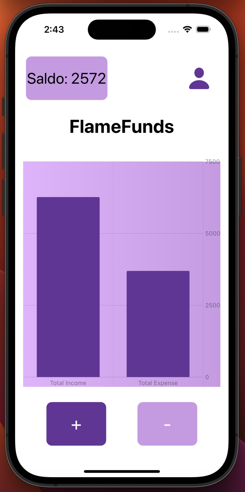
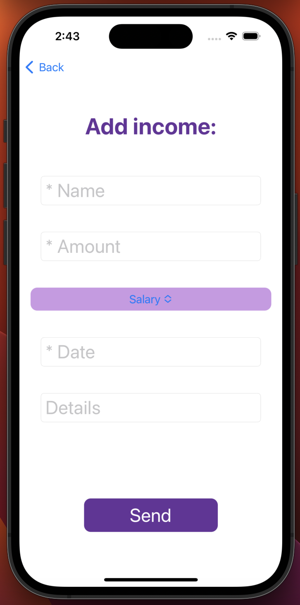
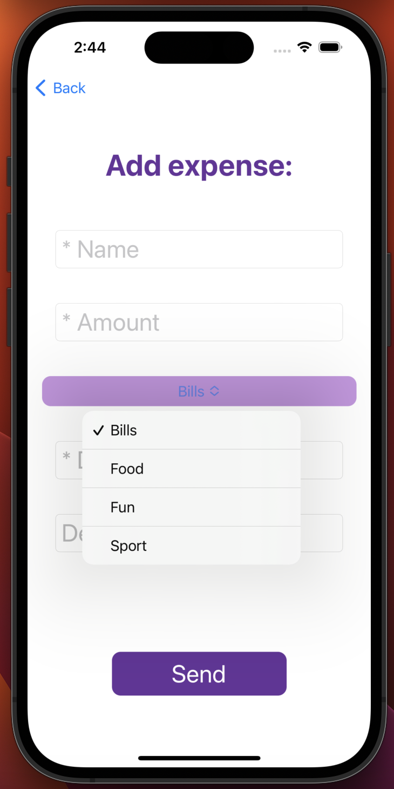
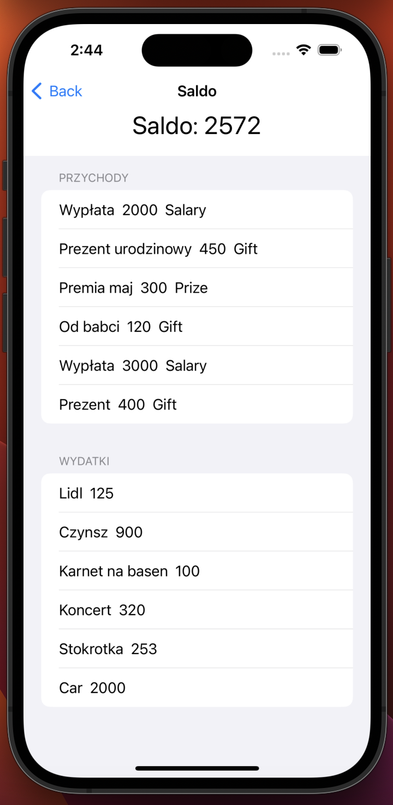

# Household budget management application - Solo project
# SwiftUI, CoreData

Charts were prepared using the Charts library and showing the data broken down by total income and expenses.
The CoreData database contains 4 entities linked by one-to-many relationships (Income,CategoryIncome and Expense,CategoryExpense). 
Gestures used: LongPressGesture - which changes the color of the caption on the main screen, and TapGesture - which supports pressing controls.
Validation of data in forms and display of messages with the help of showAlert and alertMessage were prepared. 
The following are checked: the presence of empty fields and the correctness of the date and amount format.

## Main screen
Home screen with 4 controls and a chart using the Charts library.

## Adding income and expense screen
Screen for adding income with 4 controls allowing user text entry and a Picker type field.

## History screen
History screen with a list of transactions by income and expense and a field displaying the current balance.

